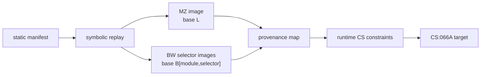

# DOS/16M loader symbolic replay 설계

## 목표

복원된 copy/relocation manifest를 실행 가능한 loader state로 변환하되 DOS나 DOS/16M CPU 전체를 실행하지 않는다. 각 byte의 원본 file provenance와 relocation 식을 유지하여 최종 runtime 주소를 원본 코드로 역추적한다.

## 상태 모델

* MZ load segment는 기호 `L`로 둔다. 각 DOS relocation word는 `original + L` 식으로 기록한다.
* BW group은 `(module, selector)`별 독립 byte image와 기호 base `B[module,selector]`를 갖는다.
* `OPT_ROTATE`가 꺼진 현재 DOS4GW module은 declared selector를 identity mapping으로 유지한다.
* RSI-2 offset의 word가 reserved selector 또는 module selector이면 selector mapping을 적용하고, 원본 file offset과 변경 전후 값을 기록한다.
* BSS는 zero-filled image로 만들고 file provenance는 `null`로 유지한다.
* entry point, executable selector, relocation target은 모두 bounds validation을 거친다.

## 성공 조건과 정직한 경계

replay 결과는 MZ/BW image가 재현되고 모든 relocation이 적용된 상태, entry point mapping, byte provenance 및 `CS:[0x066A]` 해석에 필요한 constraint를 출력한다. resident loader가 MZ source range를 다른 runtime CS layout으로 재배치하는 규칙이 table 외 code path에만 존재하면 이를 임의로 가정하지 않고 unresolved constraint로 출력한다.

# DOS/16M Loader Symbolic Replay Design

Convert the recovered manifest into symbolic MZ and BW runtime images without executing DOS or the full CPU. Preserve source-file provenance and relocation expressions for every affected word. Model the MZ base as `L`, BW group bases as `B[module,selector]`, apply identity selector mapping when rotation is disabled, create zero-filled BSS, validate all entries, and emit explicit unresolved constraints instead of inventing resident-layout rules not encoded by the tables.
