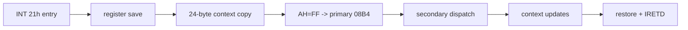

# DOS/4G service 0 frame 및 반환 데이터 흐름 복원 설계

## 목표

resident `INT 21h AH=FFh` router가 만드는 saved frame의 각 offset을 저장·복원 코드로 확정하고, service 0 primary/secondary handler가 `AX=FF00h`, `DX=0078h`에 대해 변경하는 register와 flags를 원본 file offset까지 추적한다.

## 분석 규칙

* `PUSHA/PUSH segment`, context copy, handler access, restore/`IRETD`를 양방향으로 대조한다.
* frame field 이름은 두 개 이상의 독립 access가 일치할 때만 확정한다.
* `AX=FF00h`, `DX=0078h` 입력을 instruction 단위로 전파하되 외부 함수와 전역 값은 기호로 유지한다.
* `GS`가 직접 설정되는지, 이미 설치된 client data selector가 보존되는지 구분한다.
* DOS/32A는 반환 계약의 교차 참고일 뿐 DOS4GW 내부 frame 근거로 사용하지 않는다.

# DOS/4G Service-Zero Frame and Return Data-Flow Design

Recover the saved-frame layout by matching register saves, the 24-byte context copy, handler accesses, restoration, and `IRETD`. Propagate `AX=FF00h`, `DX=0078h` instruction by instruction, retain unknown globals or calls symbolically, distinguish direct GS assignment from preservation, and use DOS/32A only as an external contract cross-check.
