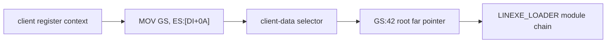

# DOS/4G client GS와 private environment 생성 역추적 설계

## 목표

service-zero가 보존하는 GS의 최초 설정 지점과 source context field를 찾고, 해당 selector descriptor의 base/limit 및 `GS:0x42` root/module chain population store를 원본 file offset으로 연결한다.

## 분석 방법

* 모든 BW executable segment에서 실제 GS load/restore instruction을 열거한다.
* 임시 GS 변경과 client transition restore를 push/pop 대칭성으로 구분한다.
* `ES:DI` context의 `+0x0A` writer와 descriptor 생성 경로를 역추적한다.
* selector base image의 `+0x42` store와 module/export 이름 provenance를 교차한다.
* 구조를 만들지 않는 service-zero handler 자체와 사전 구성된 client environment를 구분한다.

# DOS/4G Client GS and Private-Environment Construction Design

Locate the original assignment of the GS preserved by service zero, trace the writer of the client-context `+0x0A` field and its descriptor, and connect stores at selector offset `0x42` to the `LINEXE_LOADER` module/export chain. Distinguish temporary GS swaps from client-transition restoration and separate the prebuilt environment from the service-zero handler that merely preserves it.
