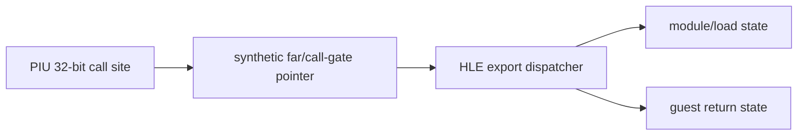
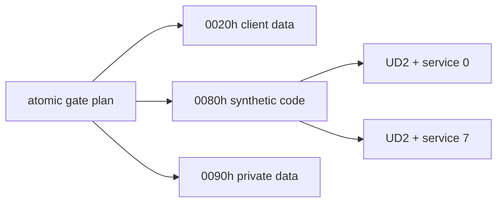

# LINEXE export HLE call-gate ABI 복원 설계

## 목표

PIU가 사용하는 네 LINEXE export의 실제 call site를 모두 찾고, register/stack argument, return value, side effect를 복원하여 16-bit code 실행 없이 동등한 guest-callable HLE call-gate ABI를 정의한다.

## 원칙

* export 이름 검색 결과가 저장되는 PIU global과 모든 indirect call을 연결한다.
* 호출 전 stack/register와 호출 후 정리·비교를 함께 분석한다.
* PIU에서 사용하지 않는 LINEXE export는 구현 범위에 포함하지 않는다.
* 합성 pointer는 현재 32-bit trampoline이 포착 가능한 명시적 trap entry를 가리킨다.
* private environment, 성공 `AX/CF/GS`, 네 call-gate가 모두 준비된 뒤 원자적으로 활성화한다.

# LINEXE Export HLE Call-Gate ABI Recovery Design

Recover every PIU call site for the four required LINEXE exports and derive register/stack arguments, returns, and side effects. Define synthetic trap-backed guest-callable pointers that the current 32-bit trampoline can intercept, implement only observed exports, and activate the private environment, identification result, and gates atomically.

## 복원 결과 / Recovered scope

정적 호출부 분석 결과 실제 범위는 네 개가 아니라 여덟 export입니다. 게이트 테이블은 `LINEXE_LOADMODULE`, `LINEXE_FREEMODULE`, `GETLOADTABLE`, `GETLOADNAME`, `LINEXE_GETMODHANDLE`, `LINEXE_GETPROCADDR`, `REL`, `UNREL`을 하나의 단위로 설치해야 합니다. 상세 ABI는 [`../analysis/piu-linexe-call-gate-abi.md`](../analysis/piu-linexe-call-gate-abi.md)에 둡니다.

Static call-site analysis expanded the required surface from four to eight exports. The gate table must install all eight as one unit; the linked analysis records their observed ABI.

## 합성 게이트 배치 / Synthetic gate layout

플랫폼 공용 `LinexeCallGatePlan`은 복원된 selector `0020h/0080h/0090h`와 여덟 서비스를 하나의 유효성 단위로 관리합니다. 각 게이트는 8바이트 간격이며 `UD2`와 서비스 식별 바이트로 시작합니다. `UD2`는 Win32 사용자 모드에서 예외 경계가 분명하고, 원본 16비트 코드를 실행하지 않으면서 디스패처가 정확한 서비스를 선택하게 합니다.

The shared plan owns the recovered selectors and all eight services as one validity unit. Eight-byte trap slots begin with `UD2` plus a service tag, providing an unambiguous exception boundary without executing original 16-bit code.
