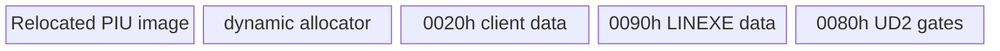

# LINEXE 전용 arena 예약 설계

## 결정

원본 DOS/4GW와 가장 유사하게 selector가 실제 guest arena 메모리를 가리키도록 합니다. 후속 실행에서 원본 allocator가 `relocated_hle_reserve_base` 직후를 즉시 사용하는 것이 확인되어, client data, private data, 합성 코드 페이지는 arena 상단의 마지막 세 페이지로 이동했습니다. 동적 범위는 정렬된 HLE reserve base부터 전용 페이지 직전까지입니다.

layout 생성은 다음 조건을 원자적으로 검증합니다.

* HLE base와 arena end가 유효해야 합니다.
* 세 페이지와 이후 allocator 영역이 32비트 주소 범위 및 arena 안에 있어야 합니다.
* layout이 유효하지 않으면 `AX=FF00h` 원본 호환 응답을 활성화하지 않습니다.

공용 게이트 계획은 client root `0020:0042 -> 0090:059A`, `LINEXE_LOADER` module record, 여덟 export entry와 이름을 페이지 이미지로 함께 생성합니다. export value는 원본 16비트 offset 대신 동일 서비스의 `0080h` 합성 trap offset을 가리킵니다.

# LINEXE-Owned Arena Reservation Design

To mirror DOS/4GW, selectors point to real guest-arena memory. Three pages at the aligned relocated HLE reserve base are owned by client data, LINEXE private data, and synthetic code; the dynamic allocator starts after them. Layout validation is atomic, and DOS/4GW identification remains disabled when the layout is invalid.
