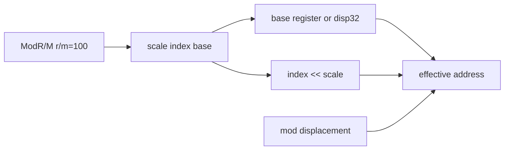

# x86 SIB memory 주소 해석 설계

## 목표

기존 memory HLE decoder를 ModR/M base+displacement 전용에서 32비트 SIB 주소까지 확장합니다. 새 frontier `C7 04 02 FF FF FF FF`는 `mod=00`, `r/m=100`, SIB `scale=1,index=EAX,base=EDX`이므로 목적지는 `EDX+EAX`입니다.

decoder는 SIB 없는 기존 형식, absolute disp32, SIB의 no-index/no-base 규칙, disp8/disp32를 함께 처리합니다. store handler의 sentinel/provenance 정책은 바꾸지 않습니다.

# x86 SIB Memory Address Decoding Design

Extend the shared ModR/M address decoder to cover 32-bit SIB, absolute disp32, no-index/no-base encodings, and mod displacements. Keep existing allocator sentinel and provenance policy unchanged.
