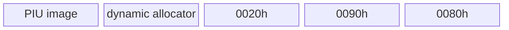

# LINEXE arena와 allocator 충돌 교정 설계

## 확인된 원인

초기 배치는 HLE 페이지를 `0x025D7000~0x025DA000`에 두었고 원본 allocator는 metadata `OR` 목적지로 `0x025D83E4`를 선택했습니다. 즉 private-data 페이지와 실제 allocation이 겹쳤습니다. 실제 OR 적용 뒤 발생한 중첩 예외는 이 충돌로 인한 private data/allocator 상호 손상이었습니다.

```mermaid
block-beta
  columns 4
  image["image end"] collision["allocator + private data collision"] slack["arena slack"] end["arena end"]
```

## 교정

원본 allocator 시작 위치는 유지하고 HLE 세 페이지를 arena 상단 끝에 배치합니다. selector는 계속 실제 guest arena memory를 가리킵니다.



동적 범위는 `[aligned relocated_hle_reserve_base, client_data_base)`이며 전용 페이지는 arena의 마지막 세 페이지입니다. 실제 metadata OR를 다시 사용하고 shadow는 arena 밖 metadata에만 유지합니다.

# LINEXE Arena/Allocator Collision Correction Design

The allocator selected `0x025D83E4` inside the original LINEXE private page range. Move the three real guest-memory HLE pages to the top of the arena while preserving the allocator start. Use real metadata OR inside the arena and retain shadow only outside it.
