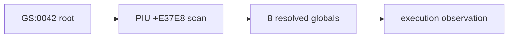

# LINEXE export 해석 관찰 설계

PIU의 private-environment 탐색 결과를 동작 변경 없이 확인하기 위해 실행 종료 시 다음 guest global을 캡처합니다.

* object 4 resolved export slots: runtime base `+0x1A62C4`, 8바이트 간격 8개
* LINEXE selector globals: runtime base `+0x0C68C0`부터 네 word

관찰값이 모두 0이면 root/module 접근 실패, 일부만 채워지면 export layout/name 문제, 모두 채워졌는데 fatal이면 후속 selector/gate 초기화 문제로 분류합니다.

# LINEXE Resolution Observation Design

Capture the eight resolved export globals and four selector words at execution completion without changing guest behavior. Zero, partial, and complete results distinguish root/module failure, export mismatch, and downstream gate initialization failure.
