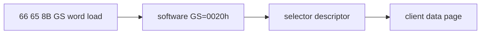

# GS selector word-load HLE 설계

LINEXE root 탐색은 `66 65 8B`로 `GS:0042h`의 offset/selector word를 읽습니다. software GS는 `0020h`이지만 Win32 hardware GS는 `002Bh`이므로 selector table 기반 word-load가 필요합니다. 기존 FS word-load decoder를 FS/GS 공용으로 확장합니다.

# GS Selector Word-Load HLE Design

Extend the existing FS word-load path to GS so `66 65 8B` reads through software selector `0020h` and its descriptor instead of Win32 hardware GS.

일반 예외 dispatch뿐 아니라 single-step 선행 HLE 목록에도 등록해야 합니다. hardware GS 접근은 Win32 TEB에서 성공할 수 있어 access violation 경로만으로는 가로챌 수 없습니다.
