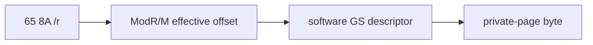

# GS byte-load HLE 설계

LINEXE module/export 이름 비교는 `65 8A /r` GS byte load를 반복합니다. ModR/M 공용 주소 decoder와 software GS descriptor를 사용해 byte를 읽고 destination 8-bit register에 기록합니다.

# GS Byte-Load HLE Design

Handle `65 8A /r` using the shared ModR/M decoder and software GS descriptor so module/export name comparisons read the synthetic private page.
