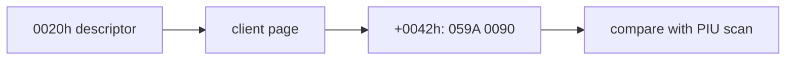

# LINEXE root memory 직접 관찰 설계

종료 시 selector `0020h` descriptor의 base/limit와 `base+0042h`의 두 word를 직접 읽어 PIU scan과 backing memory를 분리 비교합니다.

# LINEXE Root-Memory Direct Observation Design

Capture selector `0020h` descriptor and root words at `base+0042h`, separating backing-memory correctness from instruction dispatch.
