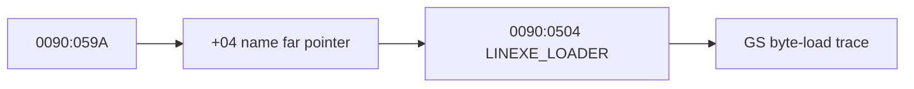

# LINEXE module name 관찰 설계

selector `0090h` descriptor와 module record `0090:059A`의 name pointer, 실제 ASCIZ bytes, GS byte-load 횟수 및 첫 접근을 캡처합니다.

# LINEXE Module-Name Observation Design

Capture selector `0090h`, the module name far pointer, direct ASCIZ bytes, and GS byte-load trace to distinguish data and dispatch failures.
