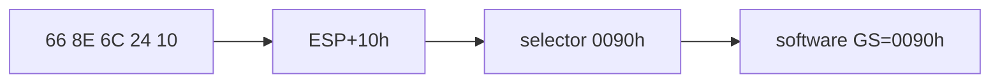

# SIB segment-load HLE 설계

PIU module 탐색은 `66 8E 6C 24 10`으로 stack의 selector `0090h`를 GS에 로드합니다. segment-load HLE가 absolute disp32와 register만 지원하여 software GS가 전환되지 않았습니다. 모든 memory form을 공용 ModR/M/SIB decoder로 해석해 word selector를 읽습니다.

# SIB Segment-Load HLE Design

Route memory-form `8E /r` through the shared ModR/M/SIB decoder so stack-based selector loads update software GS correctly.
