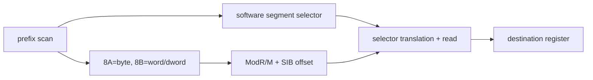

# 공용 segment memory-load decoder 설계

## 목표

segment prefix(`26/2E/36/3E/64/65`), operand-size `66h`, address-size `67h`를 순서와 무관하게 해석하고 `8A/8B` memory load를 하나의 경로로 처리합니다. effective offset은 공용 ModR/M/SIB decoder, backing은 software selector table을 사용합니다.

기존 FS-word/GS-byte 특수 handler보다 먼저 실행해 동일 명령을 공용 경로가 소유하게 합니다. 지원하지 않는 opcode와 register-only form은 기존 경로 또는 native 실행에 맡깁니다.

single-step 선행 HLE가 EIP를 다음 명령으로 옮기면 그 명령은 다음 trap 전에 실행됩니다. 따라서 다음 명령도 공용 segment load이면 연속으로 처리하여 하드웨어 segment 접근이 끼어들지 않게 합니다.

# Shared Segment Memory-Load Decoder Design

Parse segment and size prefixes in any order, decode `8A/8B` memory operands through shared ModR/M/SIB logic, translate the software selector, and write byte/word/dword destinations. Dispatch it before legacy special handlers.
