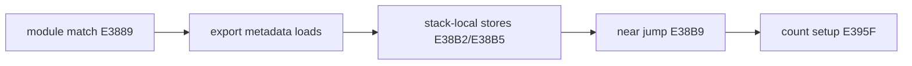

# LINEXE stack-local far pointer 보존 설계

## 목표

`LINEXE_LOADER` module match 이후 원본 코드가 보존한 module far pointer가 export count 비교 전에 사라지는 최초 명령 경계를 찾고, 특정 주소나 값을 주입하지 않고 공용 실행 의미를 복원합니다.

우선 jump 직전과 도착 직후의 `ESP`, module offset/selector, export table offset/selector를 함께 기록합니다. 값이 jump 경계에서 변하면 context/단계 전환을, 이전에 변하면 memory load/store 의미를 추적합니다.

관찰 결과 pointer는 jump 뒤에도 유지됐다. 공용 수정은 HLE가 EIP를 전진시킨 뒤 다음 segment-sensitive load/store를 처리하는 drain과, `8C /r` memory form에 software guest selector를 저장하는 경로로 구성한다.

# LINEXE Stack-Local Far-Pointer Preservation Design

Locate the first instruction boundary where the original module far pointer disappears after the `LINEXE_LOADER` match. Observe ESP and both module/export far pointers immediately before the near jump and at its target, then repair shared execution semantics without injecting address-specific values.

Observation showed that the pointer survives the jump. The shared repair drains segment-sensitive loads/stores after HLE advances EIP and stores software guest selectors for `8C /r` memory forms.
