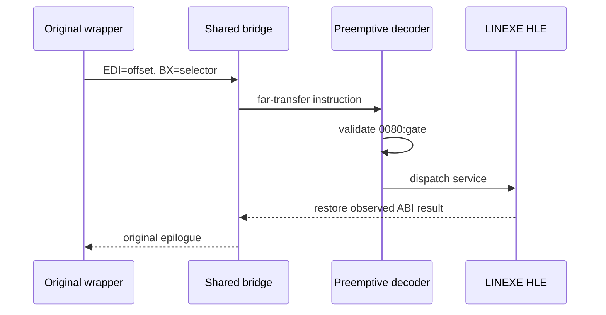

# LINEXE 선제 call-gate 전환 설계

## 목표

PIU의 원본 wrapper와 공용 bridge를 실행하되, DOS protected-mode far transfer가 host CPU에 전달되기 전에 selector `0080h`와 gate offset을 검증하여 HLE dispatcher로 전환합니다.

첫 단계에서는 bridge의 far-transfer 직전 레지스터와 stack frame을 관찰하고 합성 gate를 해석합니다. 이후 서비스별 인자와 반환 의미를 확인된 증거만으로 구현합니다. 알 수 없는 selector/offset은 가로채지 않습니다.

실행 관찰 결과 bridge보다 먼저 실제 LINEXE loader binary를 검색·수정하는 `object2+E39B4` patcher가 실행된다. 합성 HLE 환경에는 해당 binary가 없으므로, 선제 gate 전환 전에 loader patcher 호환 정책을 결정해야 한다.

# LINEXE Preemptive Call-Gate Transition Design

Keep the original wrappers and shared bridge, but validate selector `0080h` and the synthetic gate offset before the DOS protected-mode far transfer reaches the host CPU. First observe the bridge register/stack frame and decode the gate; then implement service arguments and returns only from observed evidence. Unknown targets remain unintercepted.

Observation found a real-loader binary patcher at `object2+E39B4` before the bridge. Because the synthetic HLE environment has no such binary, its compatibility policy must be decided before preemptive gate dispatch can be reached.
