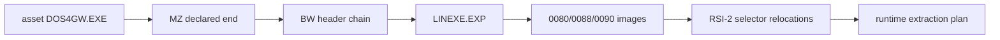

# DOS4GW asset 기반 LINEXE 런타임 추출 설계

## 목표

사용자가 asset으로 제공한 `DOS4GW.EXE`의 DOS/16M bound-module chain을 형식 기반으로 순회하고 `LINEXE.EXP`의 selector별 memory image와 RSI-2 relocation을 복원합니다. 파일 offset이나 게임 executable 주소를 고정하지 않습니다.

parser는 플랫폼 독립 `repiu::exe` 계층에 둡니다. 손상된 범위, 정렬, selector, relocation stream은 fail-closed로 거부합니다. 이번 단계는 추출 image와 크기를 검증하고, guest arena 배치 정책이 필요한 지점까지 진행합니다.

# Runtime LINEXE Extraction from User DOS4GW Asset

Walk the DOS/16M BW bound-module chain in the user-provided `DOS4GW.EXE`, locate `LINEXE.EXP` by format/name, reconstruct selector memory images, and apply RSI-2 selector relocations without fixed file offsets or executable-specific addresses. The platform-neutral parser fails closed; this stage proceeds through validated extraction and stops at the guest-arena placement policy boundary.

The validated placement preserves bound-module selector identity and page-aligns client/code/BSS/data at the arena top without executable-address branching.
