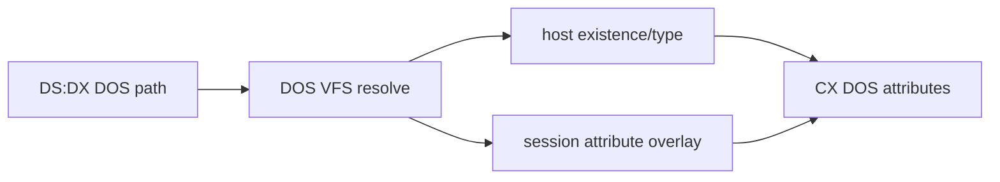

# DOS 파일 속성 HLE 설계

`INT 21h AH=43h`를 host 파일 변경 없이 DOS VFS 의미로 처리합니다. `AL=00h`는 경로를 해석해 directory/archive와 virtual override를 반환하고, `AL=01h`는 read-only/hidden/system/archive 속성을 실행 세션 overlay에 저장합니다.

host asset permission이나 파일 metadata는 수정하지 않습니다. directory/volume bit 설정, 알 수 없는 subfunction과 root escape는 fail-closed로 처리합니다.

# DOS File-Attribute HLE Design

Implement `INT 21h AH=43h` through DOS VFS semantics without mutating host assets. Query combines host existence/type with a session-only attribute overlay; set accepts read-only/hidden/system/archive bits while rejecting directory/volume mutation and unknown subfunctions.
