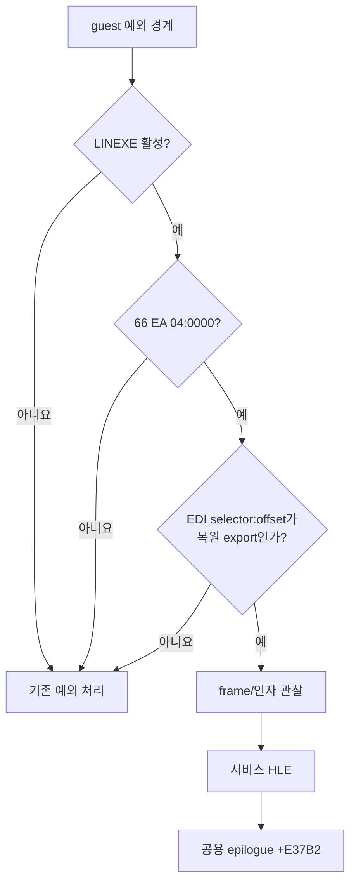

# LINEXE 원거리 전이 게이트 설계

PIU의 export wrapper가 실행하는 `66 EA 04 00 ss ss`를 실제 16비트 DOS/4GW bridge에 진입하기 전에 포착합니다. `ss ss`는 relocation이 적용한 bridge selector이므로 고정하지 않습니다. 특정 wrapper 주소 대신 활성 LINEXE 환경, 명령 형태, `EDI`에 실린 원본 export selector:offset의 세 근거를 모두 검증합니다.

첫 단계에서는 실행 상태를 변경하지 않고 `ESP`, `EBP`, export target과 stack dword를 기록합니다. 그 증거로 bridge가 추가한 임시 frame의 크기와 결과 전달 위치를 확정한 뒤, `LINEXE_LOADMODULE`부터 HLE하고 원본 wrapper가 저장한 register frame은 제거하지 않습니다. export 해석은 합성 gate offset과 원본 offset을 별도 함수로 구분합니다.

# LINEXE Far-Transfer Gate Design

Intercept the wrapper instruction `66 EA 04 00 ss ss` before it enters the real 16-bit DOS/4GW bridge. The relocated bridge selector `ss ss` is intentionally not fixed. Recognition requires an active LINEXE environment, the far-transfer opcode shape, and an `EDI` selector:offset matching a recovered original export; no wrapper address is fixed.

The first stage is observation-only and records ESP, EBP, the export target, and stack dwords. That evidence determines the temporary bridge-frame size and result location before HLE begins with `LINEXE_LOADMODULE`. The original wrapper-saved register frame remains owned by the wrapper. Synthetic gate offsets and original offsets are decoded by distinct APIs.
