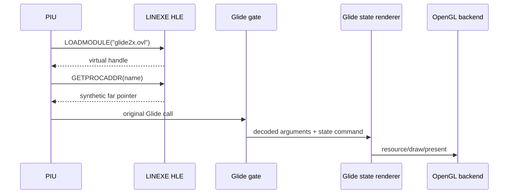

# Glide 2 OpenGL HLE 설계

`glide2x.ovl`의 3Dfx hardware 구현은 실행하지 않고 LINEXE module/export 계약을 HLE합니다. OVL resident-name table을 asset-derived metadata로 사용하여 virtual module handle과 동적 trap gate를 만들고, 실제 PIU가 요청하는 Glide 2 함수만 플랫폼 공용 state translator와 Win32 OpenGL backend로 구현합니다.

공용 계층은 module/export registry, guest ABI decoder, Glide state, texture-memory model, LFB staging 및 render command를 소유합니다. Win32 계층은 window와 OpenGL context, shader/program, GPU texture/buffer, swap을 소유합니다. target/executable 주소나 고정 export 목록에 의존하지 않으며 요청된 export를 runtime에 등록합니다. 알 수 없는 함수는 성공으로 위장하지 않고 이름·ABI·caller를 기록한 뒤 fail-closed합니다.

# Glide 2 OpenGL HLE Design

Do not execute the OVL's 3Dfx hardware implementation. HLE its LINEXE module/export contract, derive virtual handles and dynamic trap gates from the asset resident-name table, and implement only Glide 2 functions actually requested by PIU through a platform-neutral state translator and a Win32 OpenGL backend.

Shared code owns module/export registration, guest ABI decoding, Glide state, virtual texture memory, LFB staging, and render commands. Win32 code owns the window, OpenGL context, shaders/programs, GPU resources, and presentation. Unknown exports are traced and rejected rather than silently succeeding.
