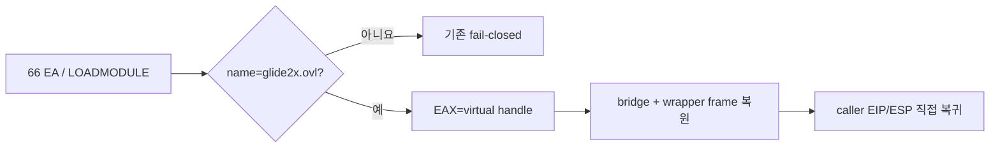

# LINEXE 가상 Glide module 반환 설계

확인된 첫 `LINEXE_LOADMODULE("glide2x.ovl")` 호출에만 opaque virtual handle을 반환합니다. 원본 16비트 bridge와 공용 epilogue의 효과를 원자적으로 재현합니다. 관찰된 frame에서 저장 ES와 `EBX/ESI/EDI/EBP`, caller EIP를 복원하고, ESP를 caller 인자 위치로 이동하며 EAX에 결과를 둡니다. native `RET`가 host SEH 경계와 충돌하지 않도록 guest 반환도 context 갱신으로 수행합니다.

주소 의존성은 기존 runtime object offset 하나로 제한되지만, handler 활성화는 opcode와 원본 LINEXE export provenance로 검증합니다. 이번 단계는 이후 `GETPROCADDR` ABI를 관찰하기 위한 최소 진행이며 아직 Glide API를 성공 처리하지 않습니다.

# LINEXE Virtual Glide Module Return Design

Return an opaque virtual handle only for the confirmed first `LINEXE_LOADMODULE("glide2x.ovl")` call. Atomically reproduce the 16-bit bridge and shared epilogue by restoring saved ES, EBX, ESI, EDI, EBP, caller EIP, and caller ESP from the observed frame while placing the result in EAX. Updating the guest context directly avoids a native RET crossing the host SEH boundary. This is a minimal step for observing the subsequent `GETPROCADDR` ABI and does not yet claim Glide API success.
