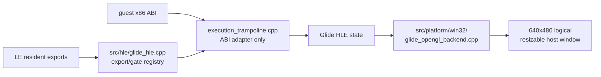

# Windowed Glide OpenGL backend 설계

PIU가 요청한 Glide 논리 해상도 640×480을 유지하면서 Win32의 일반 resizable window에 표시합니다. guest 좌표, clip, LFB와 texture 의미는 논리 surface 기준으로 유지하고 host client 크기 변화는 presentation 단계에서만 처리합니다.

큰 기능은 다음 경계로 분리합니다.

플랫폼 공용 Glide 파일은 asset-derived export lookup, ordinal gate image, decorated argument byte count와 논리 상태를 소유합니다. Win32 backend는 window class, HWND/DC, WGL context, OpenGL viewport/clear/present와 message pump를 소유합니다. trampoline은 guest stack 해석, 반환 register/stack 갱신, backend command 호출만 담당합니다.

첫 구현 범위는 `grSstWinOpen(0,7,0,1,1,2,1)`을 640×480 client window와 double-buffered OpenGL context로 여는 것입니다. 지원하지 않는 resolution 또는 context 생성 실패는 FXFALSE로 반환하고 진단을 남깁니다. 실제 rendering surface 확대, shader, texture와 buffer swap은 후속 관찰에 따라 추가합니다.

# Windowed Glide OpenGL Backend Design

Preserve PIU's 640×480 Glide logical resolution and present it in a normal resizable Win32 host window. Guest coordinates, clipping, LFB, and textures remain defined against the logical surface; client resizing affects presentation only.

Platform-neutral Glide files own asset-derived export lookup, ordinal gate images, decorated argument sizes, and logical state. The Win32 backend owns window registration, HWND/DC, WGL context, OpenGL viewport/clear/present, and message pumping. The execution trampoline remains a guest ABI adapter. The first scope maps `grSstWinOpen(0,7,0,1,1,2,1)` to a 640×480 double-buffered OpenGL window and fails closed for unsupported modes or context errors.
