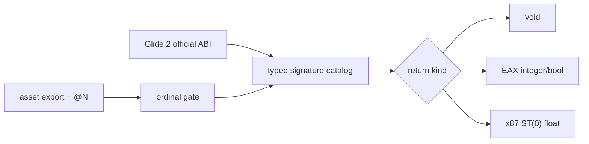

# 점진적 Glide typed signature catalog 설계

OVL resident-name table의 이름/ordinal/`@N` stack byte metadata와 별도로, 실제 PIU가 호출한 API의 argument 의미와 반환 ABI를 중앙 catalog에 기록합니다. catalog에 없는 export는 해석 pointer를 만들 수 있지만 호출 시 fail-closed로 중단하여 새로운 signature를 증거 기반으로 추가합니다.

catalog는 플랫폼 공용 `glide_hle`에 위치하며 name, stack byte count, return kind를 소유합니다. Win32 x87 register-stack encoding은 별도 `x87_context` helper가 담당합니다. trampoline은 catalog 조회, guest argument 추출, backend command와 공용 return adapter 호출만 담당합니다.

첫 범위는 이미 관찰된 init/query/select/win-open과 `grSstScreenWidth`, 예상되는 `grSstScreenHeight`입니다. float 반환은 exception `CONTEXT`의 x87 TOP/tag/80-bit register를 갱신하고 stdcall stack을 복귀합니다.

# Incremental Glide Typed Signature Catalog Design

Maintain a central catalog for the argument meaning and return ABI of Glide APIs actually called by PIU, separate from asset-derived name/ordinal/`@N` metadata. Unknown signatures may resolve to a gate but fail closed when invoked, allowing evidence-based expansion.

The platform-neutral `glide_hle` catalog owns name, stack byte count, and return kind. A separate Win32 `x87_context` helper owns x87 stack/register encoding. The trampoline only looks up signatures, extracts guest arguments, invokes backend commands, and applies return adapters. The first scope covers observed initialization calls plus `grSstScreenWidth` and the expected `grSstScreenHeight` float return.

## 후속 정정 / Later Correction

원본 caller 역추적으로 screen width/height가 x87 float가 아니라 정수 EAX로 소비됨을 확인했습니다. catalog의 두 signature는 `UInt32`로 정정됐습니다. x87 helper는 다른 관찰 경로를 위한 독립 유틸리티로 남지만 이 두 API에는 사용하지 않습니다.

Tracing the original caller proved that screen width/height are consumed as integer EAX values, not x87 floats. Both catalog signatures are corrected to `UInt32`; the independent x87 helper remains available for other observed paths but is not used by these APIs.
