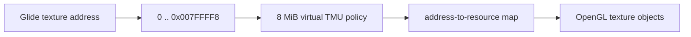

# Glide 8 MiB virtual TMU 설계

PIU 1st의 Banshee 계열 환경을 위해 TMU 0의 가상 texture address space를 8 MiB로 노출합니다. `grTexMinAddress`는 0, `grTexMaxAddress`는 가장 작은 texture의 마지막 8-byte aligned start인 `0x007FFFF8`을 반환합니다.

8 MiB는 guest-visible allocator 범위이며 host GPU memory를 즉시 8 MiB 연속 할당한다는 뜻이 아닙니다. 후속 download/source HLE가 address와 mip level을 검증한 뒤 OpenGL texture resource를 필요할 때 생성합니다. 8-byte alignment와 Glide의 2 MiB crossing restriction은 공용 texture-memory model에서 적용합니다.

# Glide 8 MiB Virtual TMU Design

Expose an 8 MiB virtual texture address space for TMU 0 to model PIU 1st's Banshee-class environment. `grTexMinAddress` returns zero and `grTexMaxAddress` returns `0x007FFFF8`, the last 8-byte-aligned start for the smallest texture.

This is a guest-visible allocator range, not an eager contiguous GPU allocation. Later download/source HLE validates addresses and mip levels, then lazily creates OpenGL texture resources. Shared texture-memory logic owns 8-byte alignment and the Glide 2 MiB crossing restriction.
