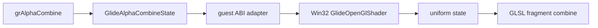

# Glide GLSL combine pipeline 설계

Glide color/alpha combine 상태를 플랫폼 공용 data로 보존하고 Win32 OpenGL backend의 범용 GLSL program에 uniform으로 전달합니다. 호출마다 shader를 재컴파일하지 않으며 실제 PIU 조합이 누적되면 검증된 연산을 같은 program에 추가하거나 shader key/cache로 분화합니다.

공용 계층은 `func/factor/local/other/invert` 원본 enum을 손실 없이 저장합니다. shader subsystem은 WGL context 이후 OpenGL 2 shader entry point를 동적으로 해석하고 compile/link log를 독립적으로 관리합니다. backend는 context 생명주기와 shader 생명주기를 순서대로 관리합니다. trampoline에는 stack decoding과 state/backend 전달만 남깁니다.

첫 범위는 관찰된 alpha combine `1,0,0,2,0`을 처리하고 color/texture input을 위한 varying/uniform 자리를 마련합니다. 미확인 combine function은 성공으로 위장하지 않고 fail-closed합니다.

# Glide GLSL Combine Pipeline Design

Preserve Glide color/alpha combine state in platform-neutral data and pass it as uniforms to a generic GLSL program owned by the Win32 OpenGL backend. Do not recompile per call; add validated equations to the same program and introduce shader keys/caching only when observed combinations justify it.

Shared code retains raw `func/factor/local/other/invert` enums. A separate shader subsystem resolves OpenGL 2 shader entry points after WGL context creation and owns compile/link diagnostics. The backend orders context and shader lifetimes, while the trampoline only decodes the guest stack and forwards state. The first scope handles observed alpha combine `1,0,0,2,0` and fails closed for unverified functions.

## 구현 확장 결과

동일한 `1,0,0,2,0` color combine을 같은 GLSL program의 uniform으로 처리합니다. 이어지는 `ONE/ZERO` alpha blend, `ALWAYS` alpha/depth compare, fog disabled 상태는 공용 논리 상태에 보존하고 Win32 OpenGL backend에서 직접 상태로 변환합니다. 가상 게이트에서 프로세스가 종료되어도 다음 API를 식별할 수 있도록 live telemetry는 마지막 Glide ordinal과 다섯 인자를 공유합니다.

다음 경계인 `grClipWindow`는 좌표 의미가 검증될 때까지 fail-closed합니다. 관찰된 오른쪽/아래 값이 guest code 주소 범위이므로 이를 framebuffer 좌표로 간주하지 않습니다.

## Implementation extension result

The same GLSL program handles the observed `1,0,0,2,0` color combine through uniforms. Subsequent `ONE/ZERO` alpha blending, `ALWAYS` alpha/depth comparisons, and disabled fog are preserved in shared logical state and translated by the Win32 backend. Live telemetry shares the last Glide ordinal and five arguments so the next API remains observable even when an unimplemented virtual gate terminates the process.

The next `grClipWindow` boundary remains fail-closed until its coordinate source is validated; observed right/bottom values fall in guest code space and must not be treated as framebuffer coordinates.
