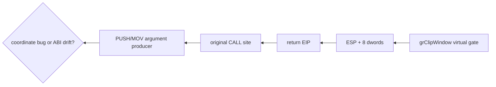

# Glide clip window ABI 역추적 설계

`grClipWindow`에 관찰된 `(0,0,0x030FED90,0x030FED8B)`을 좌표로 보정하지 않고 원본 호출부까지 역추적합니다. 가상 Glide gate 진입 시 ESP, return EIP와 여덟 stack dword를 versioned live telemetry에 원자적으로 복사합니다. return EIP 직전의 원본 명령과 stack producer를 정적·동적으로 대조하여 인자 생성 오류인지 import stub/callee cleanup 오류인지 구분합니다.

좌표를 임의로 640×480으로 대체하지 않습니다. 호출부가 정상 좌표를 push했는데 gate stack만 어긋났다면 import stub과 이전 stdcall cleanup을 수정합니다. 호출부 자체가 주소를 생성했다면 그 값의 데이터 흐름을 더 앞까지 추적합니다. 검증된 네 좌표가 확보된 뒤에만 OpenGL viewport/scissor 정책을 설계합니다.

# Glide Clip Window ABI Trace Design

Trace the observed `grClipWindow(0,0,0x030FED90,0x030FED8B)` back to the original caller without substituting corrected coordinates. At virtual-gate entry, atomically publish ESP, return EIP, and eight stack dwords through versioned live telemetry. Compare instructions before the return EIP with their stack producers to distinguish bad argument generation from import-stub or callee-cleanup drift.

Do not substitute 640×480. Fix the import stub or earlier stdcall cleanup if the caller pushes valid coordinates but the gate sees a shifted stack. If the caller itself produces addresses, trace their data flow further. Design OpenGL viewport/scissor handling only after four validated coordinates are recovered.

## 확인 결과 / Confirmed Result

caller와 stdcall frame은 정상이었습니다. 원인은 width/height를 x87로만 반환한 HLE였으며, 원본 caller가 요구하는 정수 EAX 반환으로 수정하여 `(0,0,640,480)`을 복원했습니다. 첫 구현은 검증된 전체 화면 clip만 viewport/scissor에 적용하고 부분 clip은 origin 변환 설계 전까지 거부합니다.

The caller and stdcall frame were valid. The HLE's x87-only return was the cause; integer EAX returns restored `(0,0,640,480)`. The first implementation accepts only the validated full-window clip and rejects partial clips pending an origin-aware conversion design.
