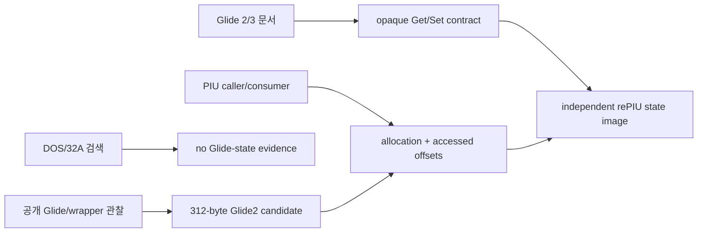

# Glide state blob 교차 검증 설계

`grGlideGetState`의 opaque `GrState`를 공개 Glide 자료와 PIU 원본 consumer를 함께 사용해 복원합니다. 외부 구현의 구조체나 코드를 복사하지 않고 크기·API 계약 후보만 참고합니다. 최종 크기와 필드 사용은 PIU의 allocation, `grGlideGetState`, `grGlideSetState`, 직접 메모리 접근으로 검증합니다.

첫 구현은 다음 조건을 모두 충족할 때만 진행합니다.

1. guest buffer가 검증된 state 크기 전체에 쓰기 가능합니다.
2. PIU가 기대하는 GetState/SetState 쌍의 호출 흐름이 확인됩니다.
3. rePIU 공용 `GlideLogicalState`에서 직렬화할 필드는 offset 근거가 있거나, guest가 blob을 opaque하게만 보관한다는 증거가 있습니다.
4. 미확인 바이트는 host pointer나 임의 값을 노출하지 않고 결정적인 0 또는 보존된 opaque byte로 처리합니다.

외부 참고 자료:

- [3dfx Glide 2.4 Reference Manual](https://www.bitsavers.org/components/3dfx/Glide_Reference_Manual_2.4_199707.pdf)
- [3dfx Glide 3.0 Programming Guide](https://www.bitsavers.org/components/3dfx/Glide_Programming_Guide_3.0_199806.pdf)
- [DOS/32A 공식 저장소](https://github.com/amindlost/dos32a)
- [Glide2 state 312-byte 호환 관찰](https://www.zeus-software.com/forum/viewtopic.php?start=10&t=2232)

# Glide State Blob Cross-Validation Design

Recover the opaque `GrState` contract by combining public Glide references with the original PIU consumer. Do not copy public implementation structures or code; use only candidate sizes and API behavior. Validate the final size and used fields from PIU allocation, `grGlideGetState`, `grGlideSetState`, and direct memory accesses.

The first implementation requires a fully writable guest buffer, a confirmed Get/Set pairing, evidence-backed field offsets or proof that PIU treats the blob as opaque, and deterministic handling of unknown bytes without leaking host pointers. Public references suggest a 312-byte Glide2 candidate, while DOS/32A provides no Glide-state evidence; neither replaces PIU binary validation.

## 확인 결과 / Confirmed Result

PIU state buffer `0x0383E180`과 다음 allocation `0x0383E2D0` 사이 간격은 336바이트입니다. 312바이트 payload와 allocator header/alignment에 부합합니다. `grGlideGetState` 직후 같은 포인터의 `grGlideSetState`가 호출되고 중간 Glide gate나 blob 직접 접근은 관찰되지 않아 PIU가 이를 opaque round-trip으로 사용함을 확인했습니다.

rePIU는 312바이트 고정 image에 magic/version과 플랫폼 중립 `GlideLogicalState` 필드를 little-endian으로 직렬화합니다. 미확인 영역은 0으로 결정화하며 host pointer를 포함하지 않습니다. SetState는 image를 검증하고 논리 snapshot을 복원합니다. 관찰 경로에는 중간 renderer state 변경이 없으므로 backend replay는 아직 수행하지 않습니다.

The PIU state buffer at `0x0383E180` is followed by the next observed allocation at `0x0383E2D0`, a 336-byte gap consistent with a 312-byte payload plus allocator metadata/alignment. `grGlideSetState` immediately receives the same pointer after GetState, with no intervening Glide gate or direct blob access, proving an opaque round-trip in this path. rePIU serializes a deterministic 312-byte little-endian logical snapshot with no host pointers and validates it on restore; backend replay remains deferred until an intervening state mutation is observed.
