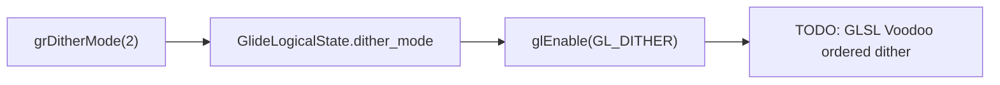

# Glide host dithering 정책 설계

관찰된 `grDitherMode(2)`를 첫 단계에서 host OpenGL의 `GL_DITHER` 활성화로 매핑합니다. 이는 원본 게임 코드와 Glide 상태 호출을 그대로 유지하면서 host rasterizer에 dithering을 위임하는 호환 경로입니다.

첫 구현은 mode 2만 허용하고 다른 mode는 fail-closed합니다. `GlideLogicalState`와 312-byte state image에 mode를 보존하여 Get/SetState round-trip이 값을 잃지 않게 합니다.

`GL_DITHER`는 현대 32-bit framebuffer에서 원본 Voodoo의 16-bit ordered dither와 동일한 픽셀을 보장하지 않습니다. 후순위 TODO는 다음 증거를 확보한 뒤 GLSL fragment pipeline에 구현합니다.

1. mode 2의 정확한 Glide symbolic constant와 matrix 동작
2. PIU 출력 color-buffer 양자화 형식
3. 원본 또는 신뢰할 수 있는 reference capture와의 픽셀 비교

# Glide Host Dithering Policy Design

Map the observed `grDitherMode(2)` to host OpenGL `GL_DITHER` as the first compatibility step, preserving the original game call path and Glide logical state. Accept only observed mode 2 and fail closed for other values. Serialize the mode in the 312-byte state image so Get/SetState retains it.

Host dithering on a modern 32-bit framebuffer does not guarantee the original Voodoo 16-bit ordered-dither pixels. Keep exact GLSL ordered dithering as a later TODO, requiring a confirmed mode-2 matrix, PIU color-buffer quantization, and pixel comparison against a trustworthy reference capture.
