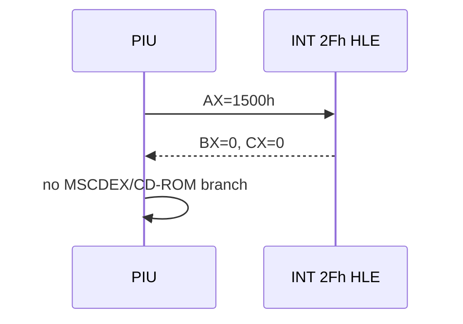

# MSCDEX INT 2Fh 설치 확인 HLE 설계

원본 guest `0x030F968B`의 `INT 2Fh`, `AX=1500h`는 MSCDEX CD-ROM drive count/install probe입니다. rePIU는 현재 CD-ROM/MSCDEX 장치를 제공하지 않으므로 `BX=0`, `CX=0`을 반환하여 설치되지 않은 환경을 명시합니다. AX와 기타 register는 보존하고 EIP를 2바이트 진행합니다.

이 처리는 관찰된 subfunction에만 적용하며 다른 `AX=15xxh`를 일반 성공으로 처리하지 않습니다. 향후 게임 asset을 CD image로 제공해야 하는 요구가 확인되면 별도 MSCDEX virtual device 설계를 작성합니다.

참고 자료:

- [Ralf Brown's Interrupt List, INT 2Fh index](https://fd.lod.bz/rbil/zint/index_2f.html)
- [MSCDEX function summary: AX=1500h](https://gist.github.com/abrasive/7a615e6dde0c1da962f9930cc63ee43d)

# MSCDEX INT 2Fh Installation Probe HLE Design

The original guest instruction at `0x030F968B` is `INT 2Fh` with `AX=1500h`, the MSCDEX CD-ROM drive-count/install probe. rePIU currently exposes no MSCDEX device, so return deterministic `BX=0`, `CX=0`, preserve AX and unrelated registers, and advance EIP by two bytes. Handle only this observed subfunction; do not generalize other `15xxh` calls. A future CD-image requirement must introduce a separate virtual MSCDEX device design.
