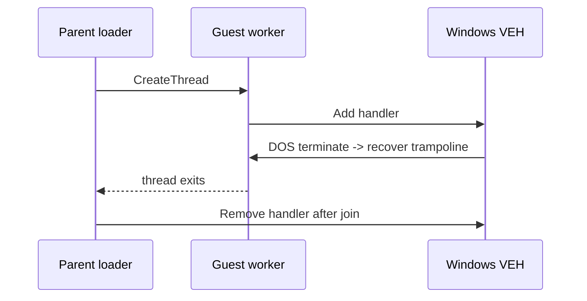

# Guest VEH parent cleanup 설계

guest thread는 vectored exception handler(VEH)를 설치하고 원본 코드를 실행합니다. DOS `AH=4Ch`가 exception handler 안에서 host recovery trampoline으로 redirect한 뒤 같은 worker가 `RemoveVectoredExceptionHandler`를 호출하면 Windows exception dispatch 생명주기와 제거가 겹쳐 대기할 수 있습니다.

VEH handle을 `ThreadContext`에 보존하고 guest worker는 handler를 제거하지 않습니다. parent가 wait 완료 후 모든 정상·예외 종료 경로에서 제거합니다. timeout에서 `TerminateThread`를 사용한 경우에도 join 이후 제거합니다. `g_active_thread_context`와 active call state는 worker가 host stack 복귀 직후 clear합니다.

host recovery는 stack과 EIP뿐 아니라 entry 전에 저장한 DS/ES/FS/GS/SS를 CONTEXT에 복원하고 TF/DF를 clear합니다. 특히 Win32 TLS는 FS를 사용하므로 guest selector가 남은 상태에서 C++ 코드로 복귀하면 안 됩니다.

# Guest VEH Parent Cleanup Design

The guest worker installs a vectored exception handler and runs original code. When DOS `AH=4Ch` redirects from inside the handler to a host recovery trampoline, removing that VEH from the same worker can overlap Windows exception-dispatch lifetime and block. Store the VEH handle in `ThreadContext`; let the worker clear thread-local execution state and exit; remove the handler only from the parent after the worker has joined, including timeout termination paths.

Host recovery also restores entry-time DS/ES/FS/GS/SS and clears TF/DF before executing C++ again. Win32 TLS depends on FS, so a guest selector must never cross the recovery boundary.
