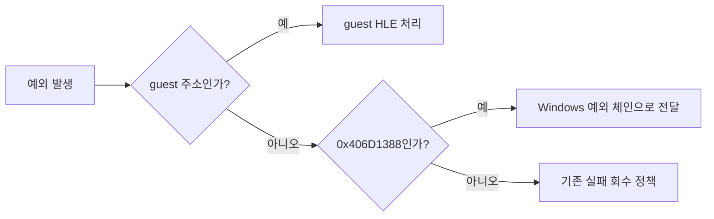
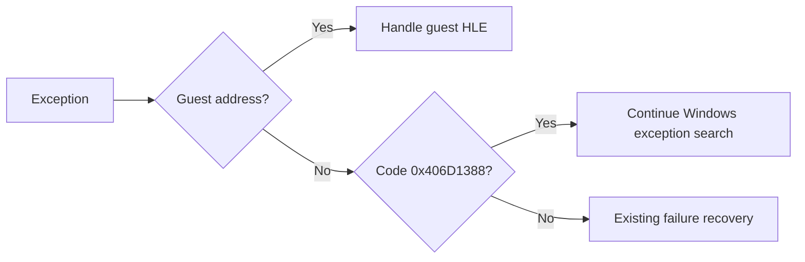

# Host VEH 예외 경계 / Host VEH Exception Boundary

## 한국어

guest VEH는 guest 주소 범위의 CPU trap과 DOS/Glide HLE 경계만 소유한다. WGL 또는 그래픽 드라이버가 host 주소에서 발생시키는 Visual C++ thread-name 예외 `0x406D1388`은 실패로 회수하지 않고 Windows 예외 체인으로 전달한다.

## English

The guest VEH owns CPU traps and DOS/Glide HLE boundaries only inside guest address ranges. A Visual C++ thread-name exception `0x406D1388` raised from a host WGL or graphics-driver address is passed to the Windows exception chain instead of being converted into a guest failure.

