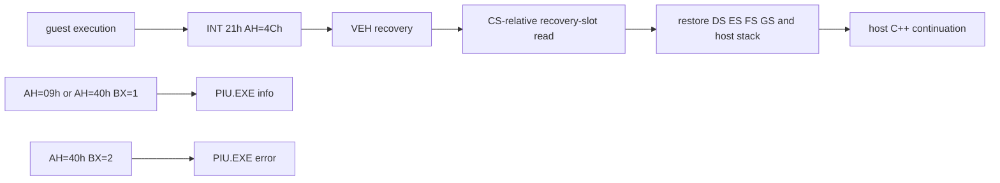

# Host 복귀와 guest stream logging / Host Recovery and Guest Stream Logging

## 한국어

guest 종료 후 recovery stub은 guest `DS`, `SS`, `FS`나 guest stack에 남은 상태 포인터를 신뢰하지 않는다. 직렬 guest worker가 진입 전에 host selector를 전용 전역 recovery slot에 저장하고, host code selector는 복귀 stub 실행에 이미 필요하므로 stub은 `CS:` override로 이 slot을 읽어 selector를 복원한다. TF/DF를 제거한 뒤 기존 C++ 호출 지점으로 돌아간다. Windows가 복귀 직후 host 주소에서 잔여 single-step을 전달하면 VEH는 TF를 다시 제거하고 host 명령을 계속 실행하며 guest 실패 복귀를 중첩하지 않는다.

WGL window와 rendering context는 guest worker가 생성하므로 같은 worker가 host 상태 복귀 직후 `GlideOpenGlBackend::Close()`를 수행한다. parent는 worker join 뒤 VEH만 제거하며, backend 소멸자의 두 번째 `Close()`는 이미 비워진 상태에서 no-op이 된다.

DOS 출력은 stream 의미를 보존한다. `AH=09h`와 `AH=40h/BX=1`은 stdout, `AH=40h/BX=2`는 stderr로 누적한다. host는 실행 파일 basename으로 별도 spdlog logger를 만들고 stdout은 `info`, stderr는 `error`로 한 줄씩 기록한다.

## English

The recovery stub does not trust guest `DS`, `SS`, `FS`, or a state pointer carried on the guest stack. Before entry, the serialized guest worker stores host selectors in dedicated global recovery slots. Because the host code selector is already required to execute the stub, it reads those slots with a `CS:` override, restores the selectors, clears TF/DF, and returns to the existing C++ call site. If Windows delivers a residual single-step at a host address immediately after recovery, the VEH clears TF and continues the host instruction instead of nesting guest-failure recovery.

The guest worker creates the WGL window and rendering context, so the same worker calls `GlideOpenGlBackend::Close()` immediately after host-state recovery. The parent removes only the VEH after joining; the backend destructor's second `Close()` is a no-op over cleared handles.

DOS stream meaning is preserved. `AH=09h` and `AH=40h/BX=1` accumulate stdout; `AH=40h/BX=2` accumulates stderr. The host creates a dedicated spdlog logger named after the executable basename and records stdout as `info` and stderr as `error`, split into lines.

