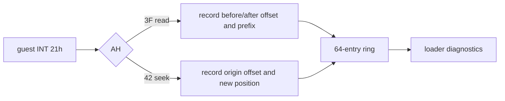
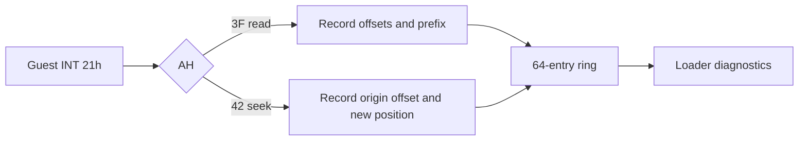

# DOS file I/O ring trace / DOS File I/O Ring Trace

## 한국어

마지막 상태 하나로는 archive parser의 seek/read 순서를 복원할 수 없다. 공용 DOS HLE에 64-entry bounded ring을 추가하여 read와 seek의 순서, handle, 파일 경로, 요청/실제 크기, 이전/이후 위치, 오류와 read 선두 16바이트를 기록한다. trace는 관찰 전용이며 guest 반환값이나 파일 내용은 변경하지 않는다.

## English

A single last-operation record cannot reconstruct an archive parser's seek/read sequence. Add a bounded 64-entry ring to the shared DOS HLE, recording read and seek order, handle, file path, requested/actual size, before/after position, error, and the first 16 bytes returned by reads. The trace is observational and does not alter guest results or file contents.

