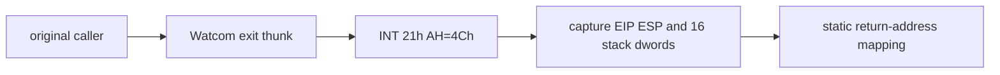

# DOS 종료 provenance / DOS Termination Provenance

## 한국어

`INT 21h/AH=4Ch`는 최종 종료 지점만 보여 주므로 호출 원인을 알 수 없다. 공용 종료 HLE에서 AX, EIP, ESP와 guest stack 상위 128 dword를 bounded capture한다. 값은 진단에만 사용하며 종료 의미를 변경하지 않는다.

## English

`INT 21h/AH=4Ch` exposes only the final termination point. The shared exit HLE captures AX, EIP, ESP, and the top 128 guest-stack dwords without changing termination semantics, allowing return addresses and preserved frame inputs to be mapped back into original code.

