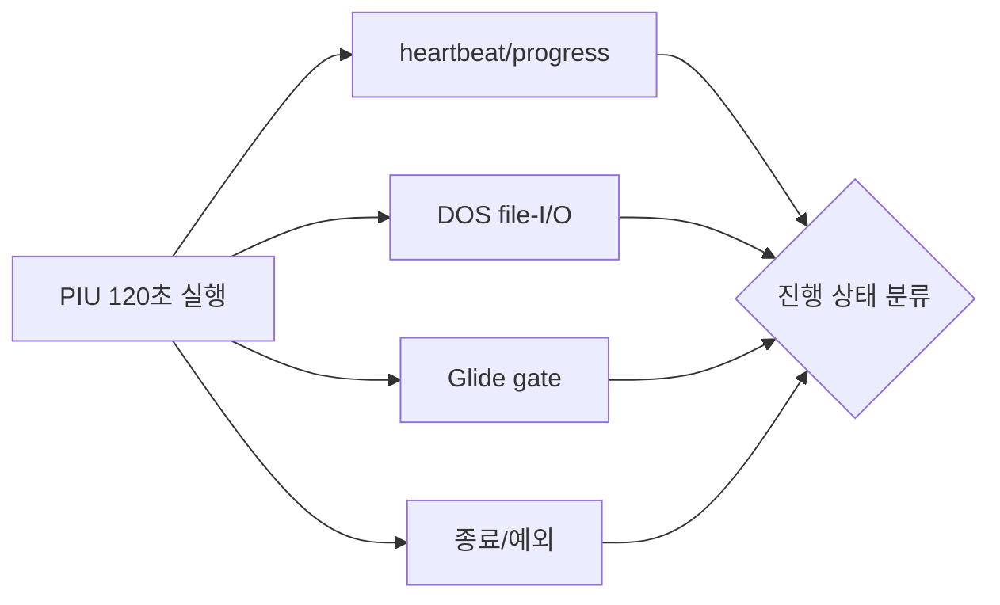

# PIU 장기 실행 관찰 / Extended PIU Runtime Observation

## 한국어

32-bit DOS/4GW read ABI 복원 후 PIU는 기존 PTX fatal을 통과하지만 40초 안에 종료하지 않는다. 관찰 제한을 120초로 늘리고 live telemetry의 heartbeat, progress, 반복 EIP, DOS file-I/O, Glide gate 및 guest 출력을 함께 수집해 정상적인 장기 처리와 새로운 blocker를 구분한다.

## English

After restoring the 32-bit DOS/4GW read ABI, PIU passes the previous PTX fatal path but does not exit within 40 seconds. Extend observation to 120 seconds and correlate live heartbeat/progress, recurring EIPs, DOS file I/O, Glide gates, guest output, and termination evidence to distinguish lengthy valid processing from a new blocker.
