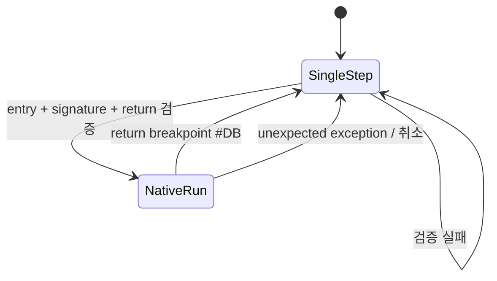

# 검증된 함수 단위 native fast path / Verified Function Native Fast Path

## 한국어

PTX bit unpack 함수의 원본 코드는 변경하거나 재구현하지 않는다. relocated object offset과 함수 시작 byte signature가 모두 일치할 때 guest stack의 반환 주소에 x86 hardware execution breakpoint를 설치하고 Trap Flag를 해제한다. CPU는 함수 본문을 직접 실행하며 반환 주소에 도달하면 `#DB`를 통해 기존 VEH dispatcher로 복귀한다.

중간에 access violation, interrupt, privileged instruction 등 다른 예외가 발생하면 debug register를 복원하고 Trap Flag를 다시 설정한 뒤 기존 HLE 처리 경로로 넘긴다. signature 불일치, 잘못된 stack, guest 범위 밖 반환 주소에서도 fast path를 시작하지 않는다.

## English

Do not modify or reimplement the original PTX bit-unpack function. Only when both relocated object offset and entry-byte signature match, install an x86 hardware execution breakpoint at the guest return address and clear Trap Flag. The CPU executes the original function directly and returns to the existing VEH dispatcher through `#DB` at the return address.

Any intermediate exception cancels the fast path, restores debug registers, reenables Trap Flag, and falls back to existing HLE handling. Signature mismatch, unreadable stack, or a return address outside guest code fails closed.
