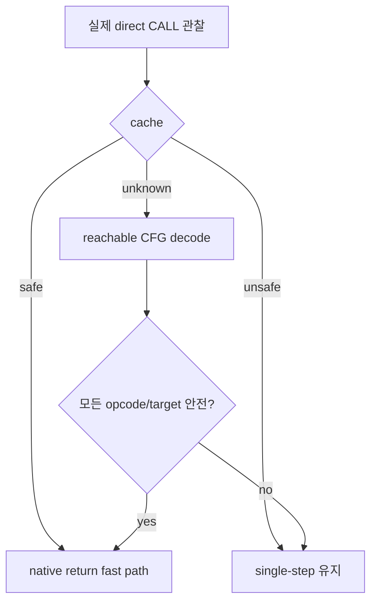

# 공용 verified-region 정책 / Generic Verified-Region Policy

## 한국어

single-step에서 직전 명령과 현재 EIP를 비교해 실제 direct `CALL` 진입만 candidate로 삼는다. candidate 함수의 reachable control-flow graph를 보수적인 x86 decoder로 순회한다. 일반 산술, register/stack, ModRM memory access, 조건·무조건 분기, 검증 가능한 direct call과 return만 허용한다.

`INT`, I/O, privileged opcode, segment override/load, string instruction, indirect call/jump, 해석하지 못한 opcode, runtime 밖 target, instruction/depth 한도 초과는 전체 candidate를 거부한다. 거부 결과도 cache해 반복 분석을 피한다. 모든 reachable direct callee가 같은 정책으로 검증될 때만 outer 함수 전체를 native return fast path로 실행한다.

## English

Compare the previous single-step EIP with the current EIP and consider only observed direct `CALL` transitions as candidates. Traverse each candidate's reachable control-flow graph with a conservative x86 decoder. Allow ordinary arithmetic, register/stack operations, ModRM memory access, conditional/unconditional branches, verifiable direct calls, and returns.

Reject the whole candidate on interrupts, I/O, privileged opcodes, segment operations, string instructions, indirect control flow, unknown opcodes, targets outside runtime, or analysis limits. Cache both safe and rejected results. An outer function is eligible only when every reachable direct callee satisfies the same policy.
