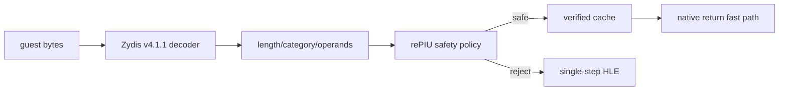

# Zydis 기반 verified region / Zydis-Based Verified Regions

## 한국어

Zydis v4.1.1 amalgamated decoder를 pinned source로 vendoring한다. Zydis는 instruction boundary, category, attribute와 relative operand를 제공하고, rePIU는 그 위에서 native 실행 안전 정책만 담당한다. decoder/CFG policy는 플랫폼 실행기와 분리된 adapter 파일로 유지한다.

허용 대상은 32-bit legacy mode에서 정확히 decode되고, reachable control flow가 runtime 안에 있으며, 모든 direct callee가 같은 정책을 통과하는 함수다. privileged, interrupt, I/O, system, segment override, indirect call/jump, far control transfer, unknown decode는 거부한다. 정상 return hardware breakpoint와 중간 예외 fail-closed 정책은 기존 구현을 재사용한다.

## English

Vendor the pinned Zydis v4.1.1 amalgamated decoder. Zydis supplies instruction boundaries, categories, attributes, and relative operands; rePIU owns only native-execution safety policy. Keep decoding/CFG policy in a dedicated adapter separate from the platform execution orchestrator.

Eligibility requires successful legacy-32 decoding, runtime-bounded reachable control flow, and recursively verified direct callees. Reject privileged, interrupt, I/O, system, segment-override, indirect/far control transfers, and unknown decoding. Reuse the existing hardware return breakpoint and fail-closed intermediate-exception behavior.
