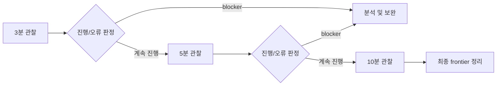

# 단계적 장기 실행 관찰 / Progressive Long Runtime Observation

## 한국어

Zydis verified-region 적용 후 PIU 실행을 3분, 5분, 필요 시 10분까지 단계적으로 관찰한다. 각 단계에서 heartbeat/progress의 증가, 반복 EIP 범위, fast-path entry/return/cancel, guest 출력과 종료 원인을 비교한다. 앞 단계에서 명확한 fatal 또는 고정 blocker가 확인되면 더 긴 실행보다 해당 원인을 먼저 분석한다.

## English

Observe PIU with Zydis verified regions for 3 minutes, then 5 minutes, and up to 10 minutes when needed. Compare heartbeat/progress growth, recurring EIP ranges, fast-path entry/return/cancel counts, guest output, and termination cause at each stage. If an earlier stage establishes a fatal or fixed blocker, analyze that cause before spending time on a longer run.
