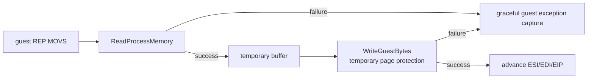

# 재진입 안전 REP MOVS / Reentrancy-Safe REP MOVS

## 한국어

VEH 내부의 `REP MOVS` HLE가 host `memcpy/memmove`를 직접 호출하면 잘못된 page 상태에서 access violation이 다시 같은 VEH로 들어와 handler 재귀를 만든다. current-process `ReadProcessMemory`와 `WriteProcessMemory`로 guest range를 임시 buffer를 통해 복사해, 잘못된 source/destination을 Win32 실패 반환으로 변환한다. overlap은 임시 buffer로 보존한다.

## English

Direct host `memcpy/memmove` inside the VEH-based `REP MOVS` HLE can recursively reenter the same handler if a guest page faults. Read through a temporary buffer with current-process `ReadProcessMemory`, then write through the existing guest-write helper, which temporarily grants write access and restores the prior protection. The temporary buffer preserves overlap semantics.
