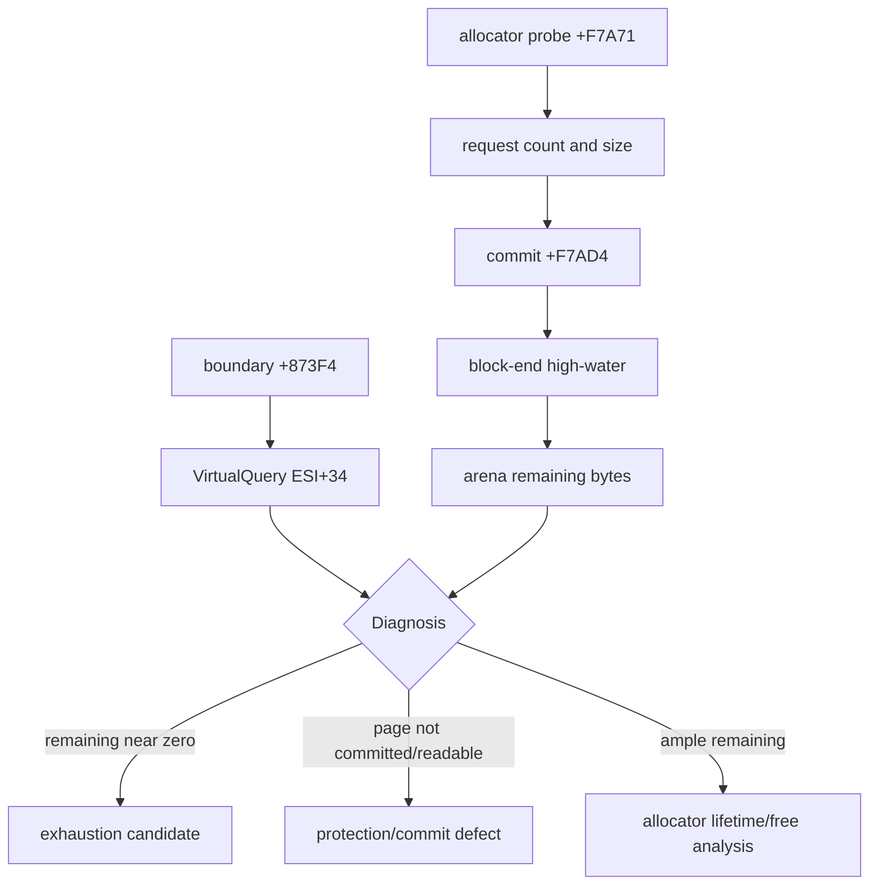

# Arena allocator high-water 관찰 / Arena Allocator High-Water Observation

## 목적 / Purpose

약 341초의 접근 위반이 8 MiB 정책의 실제 소진인지, 원본 allocator의 해제 누락인지, page protection 문제인지 구분합니다. 기존에 복원한 allocator 범위 `arena+0xF7A60..0xF7AD5`의 요청·commit을 세고, 관찰된 block 끝의 high-water와 arena 잔여량을 공유 telemetry에 기록합니다. 새 경계 `arena+0x873F4`에서는 `ESI+0x34` page의 `VirtualQuery` 상태를 기록합니다.

free entry는 정적으로 확정된 뒤에만 계수합니다. 이름이나 근거가 없는 인접 함수를 free로 추정하지 않습니다.

VEH 내부 계측은 handler stack 배치를 바꾸어 초기 `0x80000001` 회귀를 만들었으므로 사용하지 않습니다. fault page snapshot은 supervisor가 child process를 `VirtualQueryEx`/`ReadProcessMemory`로 외부 관찰합니다.

## English

Distinguish real exhaustion of the configured arena from missing frees and page-protection defects. Count requests and commits in the confirmed allocator range, retain the highest observed block end and remaining arena bytes, and capture `VirtualQuery` state for `ESI+0x34` at the later boundary. A free counter will only be added after its original-code entry is statically confirmed.

Instrumentation inside the VEH changed handler stack layout and introduced an early `0x80000001` regression. The fault-page snapshot is therefore collected externally by the supervisor with `VirtualQueryEx` and `ReadProcessMemory`.
