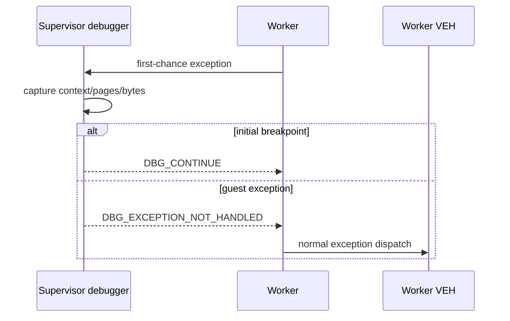

# First-chance guard-page 외부 진단 / First-Chance Guard-Page Debugging

## 설계 / Design

일반 supervisor 경로는 장시간 실행 성능을 유지합니다. 선택 인자 `debug-exceptions`가 있을 때만 child를 `DEBUG_ONLY_THIS_PROCESS`로 시작하고 Win32 debug event loop를 사용합니다. 초기 system breakpoint만 `DBG_CONTINUE`로 처리하고, guest single-step과 guard-page를 포함한 나머지 first-chance 예외는 기록 후 `DBG_EXCEPTION_NOT_HANDLED`로 전달하여 기존 VEH 의미를 보존합니다.

`0x80000001`에서는 thread context, 예외 접근 주소, EIP 주변 16바이트, EIP/fault/ESP page state와 protection을 기록합니다.

디버거 연결 시 문제가 사라지면 `REPIU_DISABLE_NATIVE_FAST_PATH=1` 비교 실행으로 hardware return breakpoint의 timing 의존성을 분리합니다.

## English

Normal supervisor mode remains unchanged for long-run performance. Optional `debug-exceptions` mode starts the child with `DEBUG_ONLY_THIS_PROCESS`. It consumes only the initial system breakpoint; all guest exceptions are logged and passed onward with `DBG_EXCEPTION_NOT_HANDLED` so the worker VEH retains ownership.

If debugger attachment suppresses the failure, a comparison run with `REPIU_DISABLE_NATIVE_FAST_PATH=1` isolates timing dependence in the hardware return-breakpoint path.

관찰 결과 일반 실행 직전의 host exception은 `DBG_PRINTEXCEPTION_C (0x40010006)`였습니다. 디버거가 없는 실행에서 `CONTINUE_SEARCH`는 process를 같은 code로 종료시키므로, host EIP의 ANSI/Wide debug-print exception은 `EXCEPTION_CONTINUE_EXECUTION`으로 소비합니다. Visual C++ thread-name exception만 기존 `CONTINUE_SEARCH`를 유지합니다.

Observation identified host-side `DBG_PRINTEXCEPTION_C (0x40010006)` immediately before the abnormal exit. Without a debugger, passing it onward terminates the process with the same code. The VEH therefore consumes host ANSI/Wide debug-print exceptions with `EXCEPTION_CONTINUE_EXECUTION`, while retaining `EXCEPTION_CONTINUE_SEARCH` for the Visual C++ thread-name exception.
