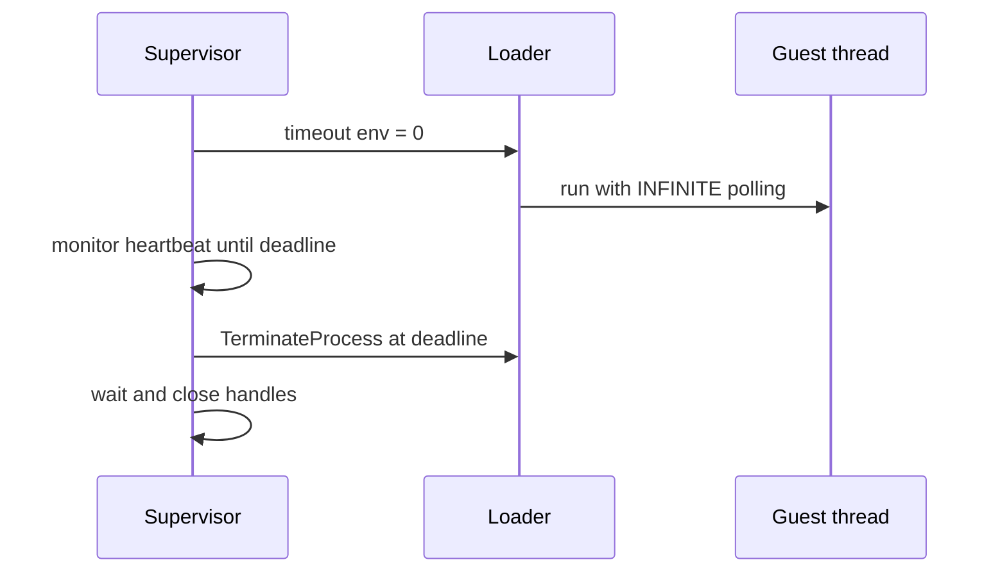

# Supervisor 전담 timeout / Supervisor-Owned Timeout

## 설계 / Design

supervisor 실행에서는 loader에 `REPIU_EXECUTION_TIMEOUT_MS=0`을 전달합니다. loader는 값 `0`을 `INFINITE`로 해석하며 wall-clock timeout과 quiet timeout을 모두 비활성화합니다. supervisor만 지정된 제한 시간을 측정하고 제한 도달 시 child process 전체를 `TerminateProcess`로 종료한 뒤 handle을 회수합니다.

이 방식은 실행 중 thread 하나만 `TerminateThread`로 제거하여 VEH/host call 상태를 남기는 경합을 피합니다. 정상 guest 종료는 기존처럼 supervisor 제한 전에 자연스럽게 회수합니다.

## English

In supervised runs, `REPIU_EXECUTION_TIMEOUT_MS=0` means `INFINITE`. Both loader wall-clock and quiet timeouts are disabled. The supervisor alone owns the deadline and terminates the complete child process, avoiding partial teardown of a guest thread while VEH or host-call state is active.
