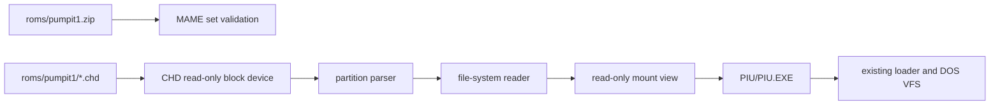

# pumpit1 MAME CHD mount / pumpit1 MAME CHD Mount

## 목표 / Goal

`pumpit1` profile은 `roms/pumpit1.zip`의 MAME ROM set 존재를 확인하고 `roms/pumpit1/*.chd`를 read-only disk로 엽니다. CHD 안의 partition/file system을 읽어 mount root를 만들고, 그 root의 `PIU/PIU.EXE`를 기존 DOS/4GW loader 시작점으로 사용합니다. ROM/CHD 원본은 수정하거나 저장소에 포함하지 않습니다.

## 경계 / Boundaries

* CHD decoder는 BSD 3-Clause 호환 standalone `libchdr`를 pinned version으로 사용합니다.
* MAME 전체 source나 emulator를 통합하지 않습니다.
* 첫 구현은 pumpit1 disk에서 실제 확인된 partition/file-system만 read-only로 지원합니다.
* 기존 DOS VFS를 유지하기 위해 mount view는 deterministic cache directory로 materialize할 수 있습니다. cache는 build tree 아래에 두며 원본 CHD SHA-1/크기로 무효화합니다.
* ZIP의 BIOS/game ROM bytes는 현재 x86 guest 실행에 직접 주입하지 않고, 올바른 MAME asset set을 선택했다는 검증과 향후 hardware HLE 입력으로 보존합니다.

## 출처 / Sources

CHD v5 header와 hunk API는 [libchdr upstream](https://github.com/rtissera/libchdr) 및 [MAME CHD source](https://github.com/mamedev/mame/blob/master/src/lib/util/chd.h)를 기준으로 합니다. standalone libchdr는 CHDv1-v5 read API를 제공하며 BSD 3-Clause 계열로 배포됩니다.

## English

The `pumpit1` profile validates `roms/pumpit1.zip`, opens the matching CHD as a read-only block device, reads its partition and file system, and exposes the disk root to the existing DOS VFS. `PIU/PIU.EXE` is the executable entry. The initial implementation supports only the partition/file-system combination confirmed in this asset and may materialize a deterministic read-only cache under the build tree.
