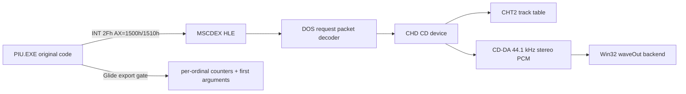

# MSCDEX CHD CD 오디오 및 Glide 호출 trace 설계

## 목표

`pumpit1` 프로파일에서 CHD를 단순 파일시스템 원본으로만 사용하지 않고, 하나의 가상 MSCDEX CD-ROM 장치로도 노출합니다. PIU의 원본 `INT 2Fh AX=1500h/1510h` 호출을 보존하며, 오디오 재생 요청은 CHD의 CD-DA 트랙을 읽어 host 오디오로 출력합니다. 동시에 Glide gate별 호출 횟수와 최초 인자를 누적해 새 API 요구를 증거로 확인합니다.

## 경계와 책임

* 공용 `ChdCdDevice`는 libchdr를 사용해 CHT2/CHTR metadata, track LBA, raw 2352-byte CD-DA sector를 해석합니다.
* 공용 `MscdexDevice`는 drive count, request header, IOCTL input, play/stop/resume 계약과 상태를 소유합니다.
* Win32 `CdAudioWaveOut`은 PCM 큐와 재생 thread만 담당합니다. MSCDEX ABI나 CHD metadata를 알지 않습니다.
* execution trampoline은 guest pointer 변환과 `INT 2Fh`/DPMI real-mode frame adapter만 담당합니다.
* Glide trace는 최대 ordinal별 누적 횟수와 첫 호출 stack 인자를 보존하며 종료 로그에 요약합니다.

## 지원 범위

첫 구현은 관찰된 `AX=1500h`, `AX=1510h`를 실제 CD drive로 응답하고 request command `03h`(IOCTL input), `84h`(play audio), `85h`(stop audio), `88h`(resume audio)를 지원합니다. IOCTL은 최소한 device status, audio-disc info, audio-track info, Q-channel/audio status를 제공합니다. 알 수 없는 command나 잘못된 guest range는 request status의 error bit로 명시하며 성공으로 삼키지 않습니다.

MSCDEX drive는 DOS drive `D:`(index 3) 하나로 고정합니다. CHD가 전달되지 않은 프로파일은 기존의 “설치되지 않음” 응답을 유지합니다.

## 주소와 오디오 정책

real-mode `ES:BX`는 `segment * 16 + offset`으로 DOS low-memory backing에 연결합니다. 보호 모드 selector가 관찰되면 selector table을 통한 선형 주소 해석을 허용합니다. CD 재생 주소 mode는 HSG LBA와 Red Book MSF를 모두 해석하며, CHD metadata의 누적 frame offset을 track LBA로 사용합니다.

CD-DA sector는 588 stereo frames, 16-bit, 44.1 kHz입니다. CHD raw audio byte order를 host little-endian PCM으로 정규화한 뒤 bounded producer/consumer queue로 waveOut에 전달합니다. stop/shutdown 시 worker와 waveOut buffer를 모두 회수해 잔류 process 원인이 되지 않게 합니다.

## 검증

* 실제 `19990930.chd`의 CHT2 track 목록과 audio track 존재를 출력합니다.
* `pumpit1` 실행에서 `AX=1500h`가 drive count 1을 반환하고 `AX=1510h` request가 packet status를 갱신하는지 확인합니다.
* play 요청이 audio LBA 범위와 waveOut 재생 상태로 이어지는지 확인합니다.
* 종료 또는 supervisor timeout 후 worker/thread/process가 남지 않는지 확인합니다.
* Glide 요약에서 ordinal별 count와 first arguments가 출력되는지 확인합니다.

## 근거

* [RBIL INT 2Fh AX=1510h](https://fd.lod.bz/rbil/interrup/io_disk/2f1510.html)
* [MAME chdman documentation](https://docs.mamedev.org/tools/chdman.html)
* 저장소의 BSD-3-Clause libchdr `chd.h`, `cdrom.h`

# MSCDEX CHD CD Audio and Glide Call Trace Design

The `pumpit1` CHD becomes both the filesystem source and a virtual MSCDEX CD-ROM. Original `INT 2Fh AX=1500h/1510h` calls remain the primary path; request commands are decoded by a platform-neutral MSCDEX device, CD metadata and raw sectors are supplied by a libchdr-backed device, and Win32 waveOut owns only PCM playback. The first scope supports IOCTL input, play, stop, and resume, exposes one `D:` drive, rejects unknown requests explicitly, and records per-Glide-ordinal counts plus first arguments. Verification uses the real CHD, checks request status and audio state, confirms clean shutdown, and prints the accumulated Glide summary.
