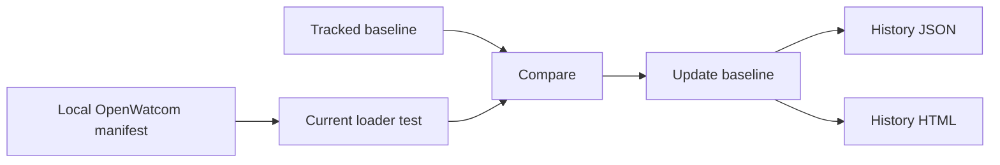

# OpenWatcom sample baseline 0.0.34 갱신 설계

현재 `main` 0.0.34의 loader로 로컬 OpenWatcom DOS/4GW sample 전체를 다시 실행합니다. 먼저 기존 baseline과 비교해 regression과 new pass를 확인하고, 같은 실행 정책으로 baseline JSON 및 날짜별 history JSON/HTML을 갱신합니다. OpenWatcom 원본 source와 EXE는 저장소에 추가하지 않습니다.

검증 결과에는 전체 sample 수, pass/fail/skip, regression, new pass, baseline version 및 생성된 history 파일을 기록합니다. 실행 후 남은 `repiu_loader_win32` process가 없는지도 확인합니다.

# OpenWatcom Sample Baseline 0.0.34 Refresh Design

Run the complete local OpenWatcom DOS/4GW sample set with the current 0.0.34 loader, compare it with the tracked baseline, and then refresh the baseline plus dated JSON/HTML history. Do not track OpenWatcom sources or binaries. Record totals, regressions, new passes, versions, generated files, and residual-process status.
