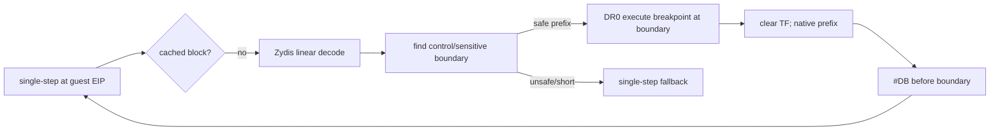

# 공용 native basic-block fast path 설계

## 문제

기존 verified-function fast path는 direct `CALL`로 진입한 함수 전체의 모든 reachable callee가 안전할 때만 동작합니다. indirect branch, 큰 CFG, HLE 경계가 하나라도 포함된 함수는 전부 single-step으로 돌아가므로 일반 decode/allocator loop에서 초당 약 8.8만 instruction 수준에 머뭅니다.

특정 PIU 주소나 signature를 추가하지 않고, 현재 EIP부터 다음 control/HLE 경계 직전까지의 straight-line basic block을 Zydis로 검증해 모든 32-bit guest EXE에 적용합니다.

## 정책

* candidate는 guest runtime 내부의 현재 EIP이며 EXE 이름, object 번호, 절대/상대 주소를 사용하지 않습니다.
* Zydis legacy-32 decoder로 최대 64개 instruction 또는 512 bytes를 선형 해석합니다.
* 일반 register, arithmetic, stack, x87, guest memory instruction은 prefix에 포함합니다.
* branch/call/return, interrupt, I/O, system, privileged, segment 변경/override instruction은 실행하지 않고 그 instruction 주소를 block exit로 사용합니다.
* 최소 4개 instruction의 안전 prefix가 있을 때만 DR0 execute breakpoint를 exit에 걸고 TF를 제거합니다.
* prefix 내부에서 access violation이나 다른 exception이 발생하면 fast path를 취소하고 해당 entry를 reject cache에 넣은 뒤 기존 VEH/HLE로 fail closed합니다.
* 기존 verified-function path를 우선 유지하고, 함수 단위 진입이 성립하지 않을 때 basic-block path를 시도합니다.
* safe/reject 결과는 entry별 cache로 재사용합니다. self-modifying code는 현재 read/execute object 정책 밖이며, 예외가 발생하면 reject됩니다.

## 검증

Win32 x86 build와 OpenWatcom baseline comparison을 실행합니다. `pumpit1`은 30초, 120초, 필요 시 장시간 실행으로 single-step/sec, block entry/exit/cancel, progress, MSCDEX 도달 여부를 기존 420초 결과와 비교합니다. cancel 또는 regression이 확인되면 허용 instruction 범위를 좁힙니다.

# Generic Native Basic-Block Fast Path Design

The current whole-function verifier falls back to single-step when any reachable indirect control flow or HLE boundary exists. Add a general, executable-independent basic-block path: decode a straight-line safe prefix from the current guest EIP, place a DR0 execution breakpoint on the next control or sensitive instruction, clear TF, and resume single-step before that boundary executes. Cache safe and rejected entries and fail closed on any intermediate exception. Keep the existing whole-function path first, validate Win32 x86 and OpenWatcom, and compare pumpit1 throughput and progress without using EXE names or fixed addresses.

## 실험 결과 및 채택 여부

이 설계의 prototype은 채택하지 않았습니다. 임의 memory를 허용하면 30초 progress가 `10,637`로 하락했고, register/SS-stack만 허용하면 `116,274`로 기존 `116,424`를 넘지 못했습니다. 최소 block 2일 때 약 70,000회, 최소 block 8일 때 411회의 hardware breakpoint 왕복이 발생했지만 최종 병목은 개선되지 않았습니다. 모든 prototype code는 기준 코드로 되돌렸습니다.

일반 memory instruction은 fault가 나지 않더라도 shadow/HLE 의미를 필요로 할 수 있으므로 정적 basic-block만으로 안전성을 증명할 수 없습니다. 다음 설계는 아래 중 하나를 선택해야 합니다.

1. runtime indirect-target profiling을 기존 verified-function 재귀 검증에 결합합니다.
2. code cache 기반 dynamic binary translation을 도입합니다.
3. 원본 code page patch/guard로 HLE boundary gate를 설치합니다.

원본 코드 보존과 변경 규모를 고려하면 1번을 우선 권장합니다.

## Experiment Result and Disposition

The prototype was rejected. Permitting arbitrary memory reduced 30-second progress to 10,637; restricting blocks to registers and SS-stack memory reached 116,274, still below the existing 116,424. Hardware-breakpoint trips did not improve the final bottleneck, and all prototype code was reverted. Static blocks cannot prove that a mapped memory operation does not require shadow/HLE semantics. The next architecture decision is runtime-profiled indirect-target verification, a DBT code cache, or patched/guarded HLE boundary gates; runtime-profiled function verification is recommended first.
