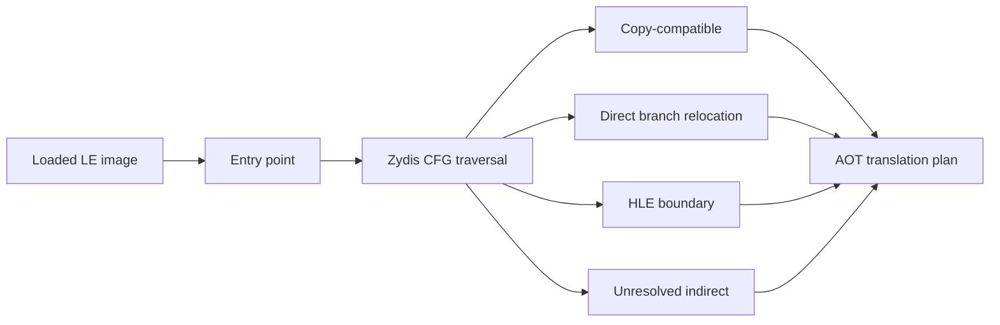

# AOT 변환 계획 prototype 설계

## 목표

실행 중 instruction별 비교 없이 loader 시작 단계에서 DOS/4GW 32-bit x86 code의 reachable CFG를 복원하고 AOT code-cache 생성 가능성을 수치화합니다. 첫 단계는 원본 실행을 대체하지 않으며, 변환 계획과 coverage·시간을 검증합니다.

## 분류 정책

* 일반 legacy-32 instruction은 copy-compatible로 분류합니다.
* direct call/jump/conditional branch는 target과 fallthrough를 CFG에 추가하고 rel32 재작성 대상으로 분류합니다.
* `INT`, I/O, system, privileged, segment instruction은 HLE boundary로 분류하고 해당 경로 탐색을 종료합니다.
* indirect/far call/jump와 return은 unresolved exit로 기록합니다. return은 정상 함수 출구로 별도 집계합니다.
* decode 실패, image 밖 target, instruction/block 한도는 명시적 reject 사유로 기록합니다.
* object의 executable 여부가 완전히 복원되지 않은 현재 단계에서는 entry/direct target에서 reachable한 byte만 code로 간주합니다.

## 산출물

공용 `AotTranslationPlan`에는 instruction/block 수, 원본 code byte 수, 예상 emitted byte 수, direct edge, HLE boundary, return, indirect exit, decode failure, coverage와 elapsed time을 저장합니다. CLI probe는 PIU 또는 임의 DOS/4GW EXE를 받아 요약과 Mermaid가 아닌 machine-readable text를 출력합니다.

## 성공 기준

* PIU와 OpenWatcom sample에서 crash 없이 bounded CFG를 생성합니다.
* PIU 최초 계획 시간이 5초 이내입니다.
* direct reachable code와 unresolved indirect 비율을 산출해 실제 code-cache 실행 prototype의 범위를 결정할 수 있어야 합니다.

# AOT Translation Plan Prototype Design

Build an executable-independent, pre-execution Zydis CFG and classify reachable legacy-32 instructions as copy-compatible, direct-relocation, HLE boundary, return, unresolved indirect, or decode failure. This phase does not replace execution; it measures bounded coverage, emitted-size estimates, and planning time for PIU and OpenWatcom so the actual code-cache execution prototype can be scoped with evidence.
