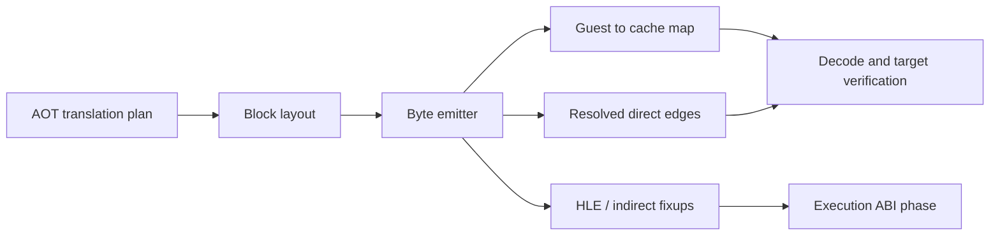

# AOT 코드 캐시 emitter 설계

## 목표

179 단계의 도달 가능 CFG를 실제 byte image와 주소 매핑으로 구체화합니다. 이번 단계는 생성물을 실행 경로에 연결하기 전의 안전한 중간 단계이며, 모든 내부 직접 분기를 code-cache 주소로 해결하고 HLE 및 간접 분기는 명시적인 외부 fixup으로 남깁니다.

## 정책

* 일반 명령과 반환은 원본 바이트를 보존합니다.
* direct jump는 `rel32`, call과 Jcc는 각각 target edge 뒤에 명시적인 fallthrough `jmp rel32`를 붙여 block 배치 순서와 무관하게 정규화합니다.
* 모든 내부 분기는 두 번째 pass에서 code-cache offset으로 patch합니다.
* HLE 경계와 간접 분기는 원본 명령을 실행하지 않고 `INT 3` sentinel과 fixup metadata를 생성합니다.
* 아직 host callback ABI가 확정되지 않았으므로 생성된 image에는 `executable=false`를 유지합니다.
* 특정 EXE 주소나 opcode sequence를 별도 분기하지 않습니다.

## 검증

PIU와 OpenWatcom 표본에서 image 생성 성공 여부, 내부 fixup 해결률, 외부 fixup 수, guest/cache 양방향 주소 매핑의 일관성, emitted byte의 Zydis decode 가능성을 측정합니다.

# AOT Code Cache Emitter Design

Turn the reachable CFG from phase 179 into a concrete byte image and address map. Ordinary instructions and returns preserve their bytes, direct control flow is normalized to rel32 and resolved to cache offsets, and HLE or indirect exits become explicit sentinel fixups. The image remains non-executable until the host callback and guest-state ABI are defined and verified.
