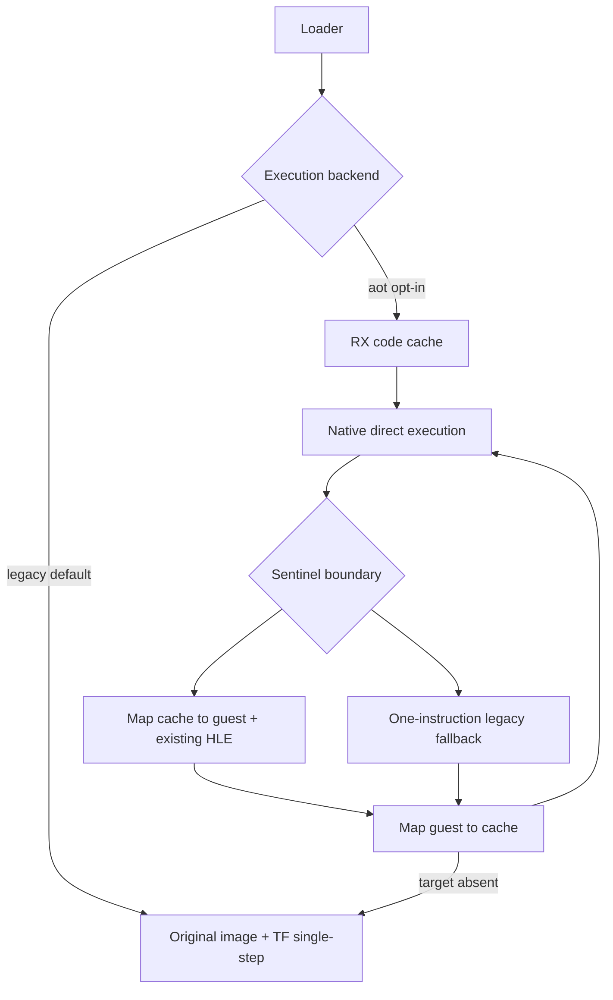

# 선택 가능한 AOT 실행 backend 설계

## 목표

기존 single-step/HLE backend를 삭제하거나 변경하지 않고, `REPIU_EXECUTION_BACKEND=legacy|aot`로 선택 가능한 Win32 AOT backend를 추가합니다. 기본값은 검증된 `legacy`이며 같은 executable과 timeout에서 진행률과 경계 횟수를 비교할 수 있어야 합니다.

구현은 두 단계로 나눕니다. 181-A는 return dispatcher 경계와 독립 RX placement/lookup을 완성하며 legacy 실행을 건드리지 않습니다. 181-B에서 opt-in VEH bridge와 backend 선택을 연결합니다.

## ABI 정책

* Win32 x86에서 별도의 `PAGE_EXECUTE_READ` cache allocation을 사용합니다.
* 일반 레지스터, EFLAGS, x87은 cache와 원본 guest instruction이 동일한 CPU thread에서 연속 실행되므로 sentinel 전환 자체가 수정하지 않습니다.
* HLE sentinel의 cache offset을 guest instruction 주소로 역매핑한 뒤 기존 handler를 호출합니다.
* direct call은 cache return trampoline을 push하고, 모든 `RET`은 dispatcher sentinel로 바꿔 cache 또는 guest return 주소를 판별합니다.
* indirect/LOOP 계열은 원본 instruction 한 개를 TF로 실행한 뒤 target을 cache로 재매핑합니다.
* 정적 map에 없는 target은 기존 legacy single-step backend로 전환하고, 알려진 cache 주소에 다시 도달하면 AOT로 복귀할 수 있습니다.
* AOT 준비나 allocation이 실패하면 실행하지 않고 legacy로 자동 변경하지 않습니다. 사용자가 선택한 backend의 실패를 명확히 보고합니다.

## 비교 관측

attempt 결과에 backend 이름, cache 진입/경계/재진입 횟수, legacy fallback 횟수, cache 생성 크기를 기록합니다. 기존 single-step progress count는 그대로 유지합니다.

# Selectable AOT Execution Backend Design

Add an opt-in Win32 x86 AOT backend while preserving the legacy single-step/HLE backend as the default. Cache sentinels map back to original guest addresses and reuse existing HLE handlers. Returns, indirect transfers, and LOOP-family instructions pass through a dispatcher; targets absent from the static map temporarily resume the legacy backend. Telemetry records both paths for later same-input performance comparison.
